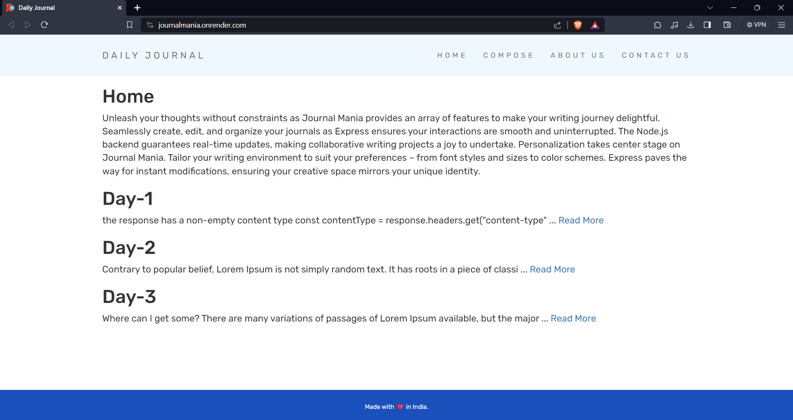
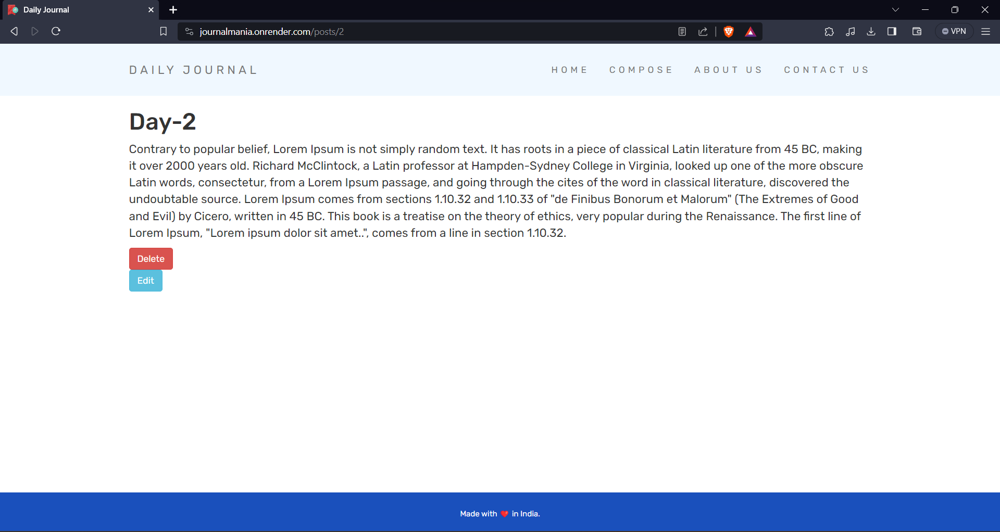
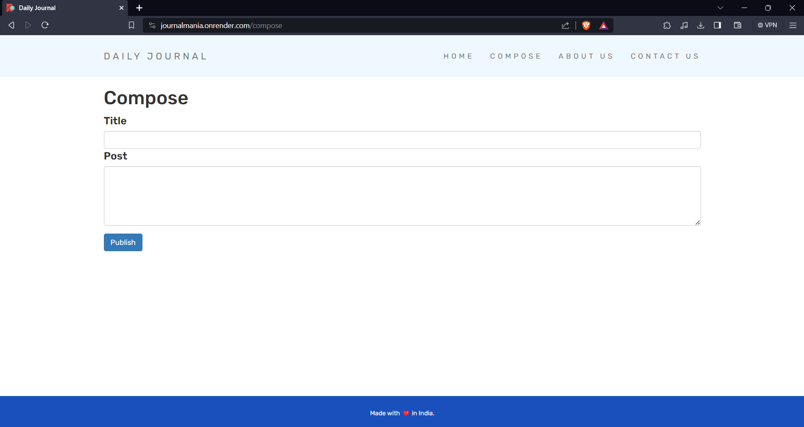

# Journal-Mania Website


## Table of Contents

- [Description](#description)
- [Features](#features)
- [Technologies Used](#technologies-used)
- [Installation](#installation)
- [Usage](#usage)
- [Folder Structure](#folder-structure)
- [Contributing](#contributing)
- [Important Codes](#important-codes)
- [License](#license)
- [Acknowledgments](#acknowledgments)

## Description

**Journal-Mania** is a web application designed to help you store and manage your daily journal entries. Whether it's a personal diary, work notes, or creative writing, Journal-Mania provides a user-friendly interface for creating, editing, updating, and deleting journal posts. While the website is not yet complete and does not include features like login and registration, it serves as a foundation for future enhancements. This project is from the Web Dev Bootcamp from Angela Yu.

### Homepage


### Individual Post Page


### Compose Page


## Features

- Create new journal entries.
- Edit and update existing journal posts.
- Delete unwanted journal entries.
- User-friendly and responsive design.
- Easy-to-navigate interface.

## Technologies Used

Journal-Mania is built using the following technologies:

- **HTML** - For structuring web pages.
- **CSS** - For styling the website.
- **Express.js** - For creating the web application and handling routes.
- **Node.js** - As the runtime environment for server-side scripting.
- **MongoDB** - As the database for storing journal entries.

## Installation

To run the Journal-Mania website locally, follow these steps:

1. Clone the repository to your local machine:

```shell
git clone https://github.com/your-username/journal-mania.git
```

2. Navigate to the project directory:

```
cd journal-mania
```

3. Install the required Node.js packages:
```
npm install
```

4. Start the Express.js server:
```
node app.js
```

5. Access the website in your web browser at `http://localhost:3000`.

## Usage
1. Open your web browser and access the Journal-Mania website.

2. Explore the user-friendly interface to create new journal entries, edit existing posts, or delete unwanted entries.

3. Start documenting your daily thoughts, experiences, or ideas with ease.

## Folder Structure
The project structure is organized as follows:

- public/ - Contains static assets like CSS and client-side JavaScript.
- views/ - Includes HTML templates for rendering pages.
- routes/ - Defines Express.js routes and handles HTTP requests.
- models/ - Contains MongoDB schemas for data storage.
- controllers/ - Manages the application logic.
- images/ - Stores images and assets used in the website.
- app.js - The main server file for running the application.

## Contributing
We welcome contributions from the community to improve Journal-Mania. If you'd like to contribute, please follow these guidelines:

- Fork the repository.
- Create a new branch for your feature or bug fix.
- Make your changes and commit them with clear, concise commit messages.
- Push your changes to your forked repository.
- Create a pull request to the main repository with a detailed description of your changes.

## Important Codes

### Code for Delete and Edit Button
```
<form action="/delete/<%= post.id %>" method="post">
    <button type="submit" class="btn btn-danger">Delete</button>
</form>

<form action="/edit/<%= post.id %>" method="get">
    <button type="submit" class="btn btn-info">Edit</button>
</form>

```

## License
This project is licensed under the MIT License - see the <u>**LICENSE.md**</u> file for details.

## Acknowledgments
- Special thanks to the open-source community for their valuable contributions and inspiration.

- This article helps me to learn the concept of working with the database connection in MongoDB.
[Mongo-DB connection](https://medium.com/featurepreneur/connect-mongodb-database-to-express-server-step-by-step-53e548bb4967)

- This article helps me to learn the concept to Mongo Atlas and how to use it.
[Mongo-DB Atlas Working](https://medium.com/featurepreneur/working-mongodb-5ae6a9d53462)
